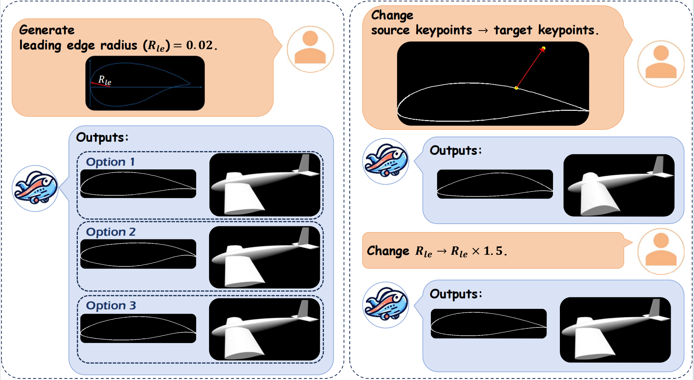
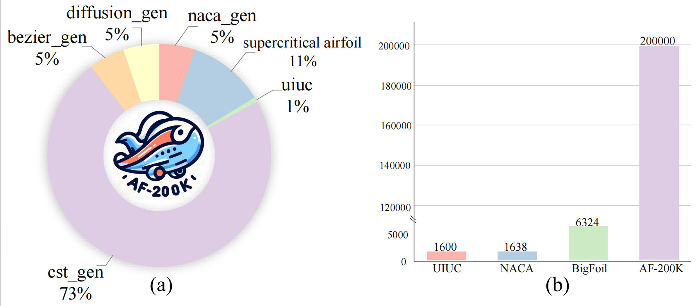
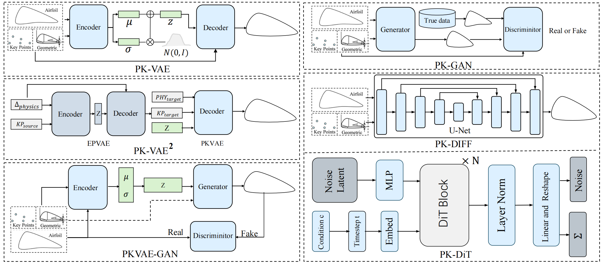

# AFBench 🚀

AFBench: A Large-scale Benchmark for Airfoil Design




- **For airfoil generation and editing demo, check [airfoil-demo](https://github.com/hitcslj/airfoil-demo) repo.**

- **For more airfoil design paper, check [awesome-airfoil-design](https://github.com/hitcslj/awesome-airfoil-design) repo.**

## [Project page](https://hitcslj.github.io/afbench/) | [Paper](https://arxiv.org/abs/2406.18846) | [Live Demo]()

- [x] Training data.
- [x] baselins models.
- [ ]  Evaluation code.
- [ ]  Training code.
- [ ] Pretrain weights.

## News
- 2024-07-05: The Wing-Wing Aircraft Wing Generation System makes its debut at WAIC 2024.


## 📚 Dataset

<p align="center">
  
</p>

In our work, we propose a comprehensive 2D airfoil dataset for studying controllable airfoil inverse design. The url for dataset: https://drive.google.com/drive/folders/1SV9Vyb0EisuG0t69YauGUyq0C5gKwRgt?usp=sharing.


 

## 💻 Code
### Environment

We tested our codebase with PyTorch 1.13.1 and CUDA 11.7. Please install the corresponding versions of PyTorch and CUDA based on your computational resources.

To install the required packages, run:
```bash
conda create -n afbench python=3.9
conda activate afbench  
pip install -r requirements.txt
```


### Data Setup

* Please download the official [AF-200K dataset](https://drive.google.com/drive/folders/1SV9Vyb0EisuG0t69YauGUyq0C5gKwRgt?usp=sharing) and navigate to the shape directory and extract the data.tar.gz file.

* The final data structure should be:
```
AFBench
├── data
│   ├── airfoil
│   │   │── 000000.dat
│   │   │── ...
|   |   |── 199999.dat
|   |── train_split.txt
|   |── val_split.txt
|   |── test_split.txt
|   |── geometry_label.txt
```

### Usage

```
usage: evaluate.py [-h] [-n NMODEL] [-w WEIGHT] [-t TASK] [-s SCORE] model

positional arguments:
  model                 The model you want to evaluate, choose between CVAE, CGAN, PKVAE, PKGAN, PKVAE-GAN, PK-DIFF, PK-DIT

optional arguments:
  -h, --help            show this help message and exit
  -n NMODEL, --nmodel NMODEL
                        Number of trained models for standard deviation estimation (default: 1)
  -w WEIGHT, --weight WEIGHT
                        Weight in front of the surface loss (default: 1)
  -t TASK, --task TASK  Task to train on. Choose between "full", "scarce", "reynolds" and "aoa"
                        (default: full)
  -s SCORE, --score SCORE
                        If you want to compute the score of the models on the associated test set.
                        (default: 0)
```

For example, if you want to evaluate the performance of the vae:
```
python evaluate.py vae -t scarce -n 2 -s 1
```


## 📈 Benchmark and Baseline



In our paper, we construct a codebase that encompasses generative methods in airfoil design, including foundational techniques such as cVAE, cGAN as well as advanced models like PK-GAN,PK-VAE,PKVAE-GAN and PK-DiT. 

### Controllable Airfoil Generation Tasks across Different Datasets

$\sigma_{i}$ represents label error between physical quantities, lower values indicate more constrained quantities. 

$\mathcal{D}$ measures generative model diversity, higher values indicate greater diversity.

$\mathcal{M}$ measures the smoothness of generated outputs, lower values indicate smoother generation.

| **Method** | **Dataset** | **$\sigma_{1}$** | **$\sigma_{2}$** | **$\sigma_{3}$** | **$\sigma_{4}$** | **$\sigma_{5}$** | **$\sigma_{6}$** | **$\sigma_{7}$** | **$\sigma_{8}$** | **$\sigma_{9}$** | **$\sigma_{10}$** | **$\sigma_{11}$** | **$\bar{\sigma}$** | **$\mathcal{D}$ $\uparrow$** | **$\mathcal{M} \downarrow \times 0.01$** |
| ---------- | ----------- | ---------------- | ---------------- | ---------------- | ---------------- | ---------------- | ---------------- | ---------------- | ---------------- | ---------------- | ----------------- | ----------------- | ------------------ | ---------------------------- | ---------------------------------------- |
| CVAE       | AF-200K     | 7.29             | 5.25             | 3.52             | 1590             | 9.9              | 9.55             | 2900             | 1.91             | 1.53             | 4.6               | 10.4              | 413.1              | -155.4                       | 7.09                                     |
| CGAN       | AF-200K     | 10.7             | 8.50             | 5.44             | 2320             | 14.3             | 13.7             | 5960             | 2.53             | 2.23             | 5.3               | 12.9              | 759.6              | -120.5                       | 7.31                                     |
| PK-VAE     | AF-200K     | 6.30             | 4.79             | 3.13             | 862              | 6.6              | 6.41             | 1710             | 1.35             | 0.93             | 3.3               | 7.8               | 237.5              | -150.1                       | 5.93                                     |
| PK-GAN     | AF-200K     | 8.18             | 6.30             | 4.70             | 2103             | 12.0             | 11.7             | 3247             | 2.25             | 1.96             | 5.0               | 12.7              | 492.3              | -112.3                       | 3.98                                     |
| PKVAE-GAN  | AF-200K     | 5.68             | 3.17             | 3.10             | 565              | 4.6              | 4.35             | 1200             | 0.91             | 0.51             | 2.8               | 6.3               | 163.3              | -129.6                       | 2.89                                     |
| PK-DIFF    | AF-200K     | 4.61             | 3.46             | 2.15             | 277              | 2.2              | 1.93             | 1030             | 0.70             | 0.11             | 2.4               | 3.1               | 120.6              | -101.3                       | 1.52                                     |
| PK-DIT     | UIUC        | 6.38             | 5.14             | 3.36             | 1183             | 8.7              | 8.49             | 2570             | 1.69             | 1.19             | 3.6               | 9.8               | 345.6              | -141.7                       | 6.03                                     |
| PK-DIT     | Super       | 5.20             | 3.50             | 2.40             | 301              | 2.9              | 3.32             | 1050             | 0.83             | 0.26             | 2.7               | 3.3               | 125.0              | -123.4                       | 1.97                                     |
| PK-DIT     | AF-200K     | 1.12             | 3.23             | 1.54             | 105              | 1.3              | 1.15             | 979              | 0.05             | 0.05             | 2.3               | 2.4               | 99.7               | -93.2                        | 1.04                                     |

### Keypoint Editing (EK) and Physical Parameter Editing (EP) Tasks

| **Method** | **Task** | **$\sigma_{1}$** | **$\sigma_{2}$** | **$\sigma_{3}$** | **$\sigma_{4}$** | **$\sigma_{5}$** | **$\sigma_{6}$** | **$\sigma_{7}$** | **$\sigma_{8}$** | **$\sigma_{9}$** | **$\sigma_{10}$** | **$\sigma_{11}$** | **$\bar{\sigma}$** | **$\mathcal{D}$ $\uparrow$** | **$\mathcal{M} \downarrow \times 0.01$** |
| ---------- | ----------- | ---------------- | ---------------- | ---------------- | ---------------- | ---------------- | ---------------- | ---------------- | ---------------- | ---------------- | ----------------- | ----------------- | ------------------ | ---------------------------- | ---------------------------------------- |
| PK-VAE     | EK       | 9.3    | 8.33   | 5.27   | 2082   | 12.9   | 11.1   | 4620   | 2.51   | 2.04   | 5.1     | 11.8    | 615.5 | -143.4  | 7.21           |
| PK-VAE     | EP       | 8.9    | 6.38   | 4.94   | 1780   | 10.9   | 9.4    | 4570   | 2.05   | 1.98   | 4.9     | 10.3    | 582.6 | -150.8  | 7.19           |
| PK-VAE²    | EK       | 7.1    | 5.71   | 4.05   | 1430   | 8.0    | 8.1    | 3780   | 1.91   | 1.52   | 3.6     | 8.7     | 478.1 | -133.4  | 6.20           |
| PK-VAE²    | EP       | 6.5    | 5.22   | 3.57   | 1010   | 7.8    | 7.3    | 2010   | 1.52   | 1.03   | 3.4     | 7.9     | 278.5 | -135.6  | 6.36           |


## 🙏 Acknowledgements

I have intensively borrow codes from the following repositories. Many thanks to the authors for sharing their codes.

- [DDPM](https://github.com/abarankab/DDPM)
- [DIT](https://github.com/facebookresearch/DiT)
- [bezier-gan](https://github.com/IDEALLab/bezier-gan)

## 📧 Contact

If you have any questions, please  contact at [hitcslj@gmail.com, wuuanu@gmail.com].

## ⚖ License

This repository is licensed under the [Apache-2.0 License](LICENSE).

## 📌 BibTeX & Citation

If you find this code useful, please consider citing our work:

```bibtex
@misc{liu2024afbenchlargescalebenchmarkairfoil,
      title={AFBench: A Large-scale Benchmark for Airfoil Design}, 
      author={Jian Liu and Jianyu Wu and Hairun Xie and Guoqing Zhang and Jing Wang and Wei Liu and Wanli Ouyang and Junjun Jiang and Xianming Liu and Shixiang Tang and Miao Zhang},
      year={2024},
      eprint={2406.18846},
      archivePrefix={arXiv},
      primaryClass={cs.CE},
      url={https://arxiv.org/abs/2406.18846}, 
}
```